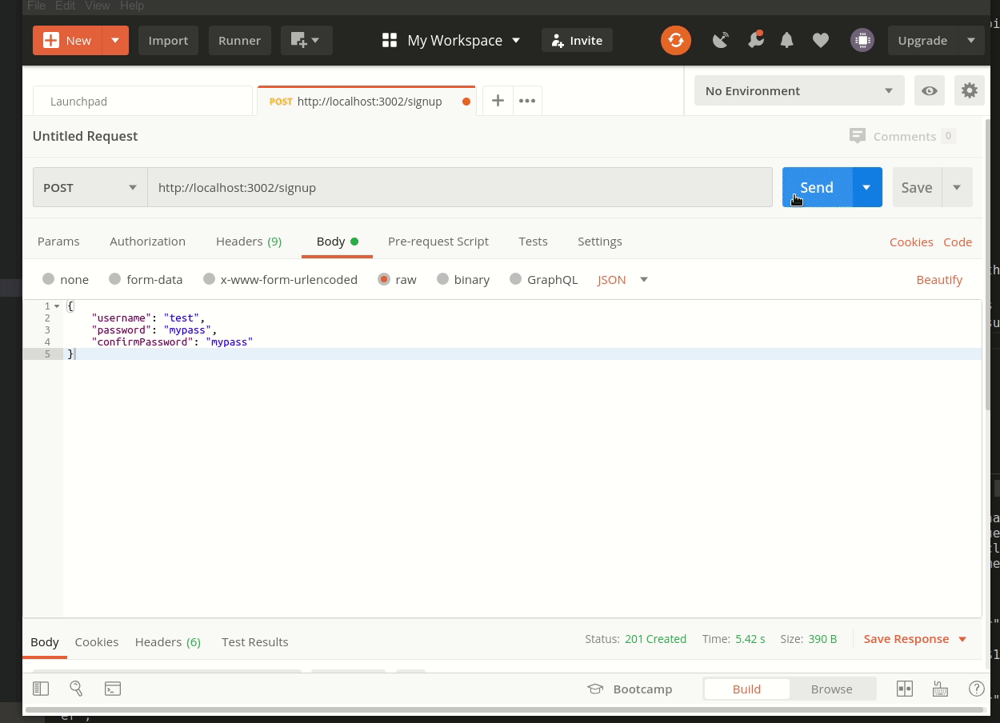

# Dockerized Auth Microservice

A completely functional authentication microservice meant to do a very simple task, which is to implement two endpoints:
* POST /signup
* POST /login

Returns a token which can get cached elsewhere and be used to verify that an identity is authenticated.

How to run this on your setup?
* Have Docker and Docker-Compose installed.
* `cd` into the directory
* `docker-compose up`

To stop the app
* `docker-compose down`

The microservice exposes and listens on :3002 by default. You can of course change that in the docker file and in the NodeJS code.

Uses a node:alpine image as a base for the nodejs app container, and a postgres image based second container serves as a datastore. Note that the data is volatile, i.e., it will get deleted when you stop the docker containers. If you intend to use these, do ensure that the persist the database data. Check [here](https://docs.docker.com/storage/) for instructions on how to go about doing that.